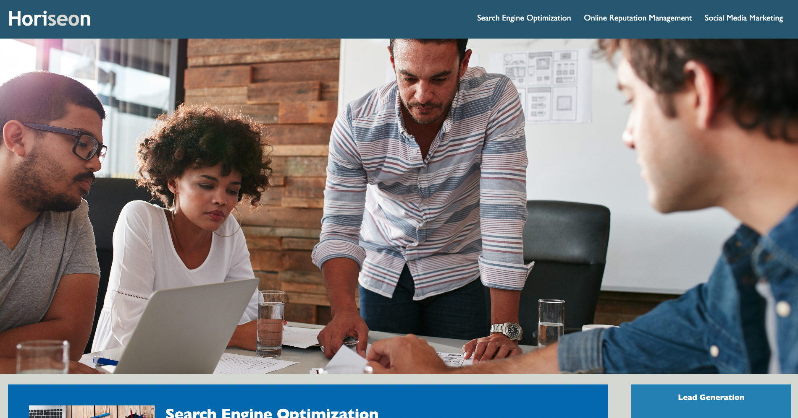

# Homework-1

## Description

The purpose of this project was to make the source code of the webpage easier to digest by changing non-semantic tags to semantic tags in the html code, as well as consolidating unnecessary repetitive code in the stylesheet. Also, to create better accessibility standards by adding alt attributes to all images.

## Credits

https://github.com/MiltonTal

## License

N/A.

